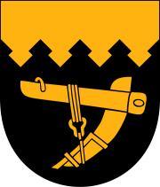

** SAVITAIPALE**

# TERVETULOA PAIMENSAAREEN!

**Viihtyisä asuinympäristö, sen hoitaminen, kehittäminen ja rakentaminen paikallisesti yhteisön omin toimin lisää asukkaidensa asumistyytyväisyyttä, lisää aktiivisuutta edelleen, kasvattaa yhteisöllisyyttä, laskee kynnystä auttaa, mutta myös pyytää apua. Haluamme ottaa vastuuta naapureistamme, lapsistamme, nuoristamme ja vanhuksistamme jo nyt ja yhä enemmän tulevaisuudessa.**

 **Yhteiskuntamme on rajussa muutoksessa. Paimensaaressa muutos on tiedostettu ja lähdetty rohkeasti vastaamaan pienessä mittakaavassa tulevaisuuden haasteisiin niin, ettei ensimmäisen kappaleen usein kuultu epistola jäisi sanahelinäksi.**

**Yhteiseen työhön oman upean asuinympäristömme puolesta tarvitsemme kaikkien panosta omien kykyjensä mukaan. Pakko on kuitenkin meille vieras sana, eikä kenenkään tule kokea syyllisyyttä, mikäli on vain "hengessä" mukana.**

 **Paimensaaren asukasyhdistys, sekä itse Paimensaari ja Savitaipaleen kunta haluavat olla esimerkkeinä, ainakin Etelä-Karjalassa, laadukkaasta, nykyaikaisesta asumisesta maaseudulla.**

 **Paimensaaren asukasyhdistys ry.**

 **___________________________________________________________**

Asukasyhdistys tulee tiedottamaan keskitetysti kotisivujemme kautta. Muun muassa valokaapelimme toiminta-asiat ja talkooasiat ja muut yhtyeiset juttumme.

**KATSO MYÖS "UUTISET"!**

 **___________________________________________________________**

**TUTUSTU ETELÄKARJALAAN TÄSTÄ LINKISTÄ: [https://ekarjala.fi/](https://ekarjala.fi/)**

**PAIMENSAARTA SIVUAVIA NETTILINKKEJÄ:**

**Savitaipaleen kunnan sivuille**: [www.savitaipale.fi ja www.visitsavitaipale.com](http://www.savitaipale.fi)

**Paimensaaresta Wikipediassa: ** [http://fi.wikipedia.org/wiki/Paimensaari](http://fi.wikipedia.org/wiki/Paimensaari)

**Olkkolan Hovi: **www.olkkolanhovi.fi

**Pro Kuolimo ry: **[www.prokuolimo.fi](http://www.prokuolimo.fi)

**Web-kamera Kuolimolle: ** [http://www.savitaipale.fi/kamera.php](https://www.savitaipale.fi/fi/kunta-ja-hallinto/tietoa-kunnasta/kuolimokamera)

**Ala-Kuolimon osakaskunta: **www.alakuolimo.fi

**Savitaipaleen aurinkosähkö ry:** www.sasry.fi

**Etelä-Karjalan Kylät, olemme jäsen** https://www.ekkylat.org/

**Paimensaarelaiset, käyttäkää lähituottajien ja savitaipalelaisten yritysten tuotteita**
ja palveluita! Tämä on juuri nyt erittäin tärkeää.

**____________________________________________________________**

**MUUTTAMASSA MAASEUDELLE**

 Hyvä ystävä, jos sinä ja perheesi, tai tuttavanne mahdollisesti suunnittelette muuttoa maalle, laadukkaampaan ja lapsille turvallisempaan elämänmuotoon, autamme teitä.

Ottakaa yhteyttä palautelomakkeella. Esittelemme mielellämme Savitaipaletta ja Paimensaarta. Kerromme todellisuudesta, mahdollisuuksista, ongelmista ja tarvittaessa autamme kädestä pitäen yhteyksien luomisessa mm. talon rakentamiseen liittyen. Yrittäjille kauttamme tuhti paketti mahdollisesta yritystoiminnan aloittamisesta Savitaipaleella. Autamme. Eikä maksa mitään!

Tervetuloa Savitaipaleelle viettämään kanssamme mukava viikonlopun päivä. Tarjoamme kahvit.

**___________________________________________________________**

**MUITA LINKKEJÄ**

https://suomenkylat.fi/maalleasumaan-fi/

www.partakoskenkylat.fi/fi

**Varautuminen kotona kriisitilanteeseen:**

[https://72tuntia.fi/wp-content/uploads/2019/10/Varautuminen-kotona-esite.pdf](https://72tuntia.fi/wp-content/uploads/2019/10/Varautuminen-kotona-esite.pdf)

Paimensaari.fi nettisivuston perusd*esign Bäcklund AE*
