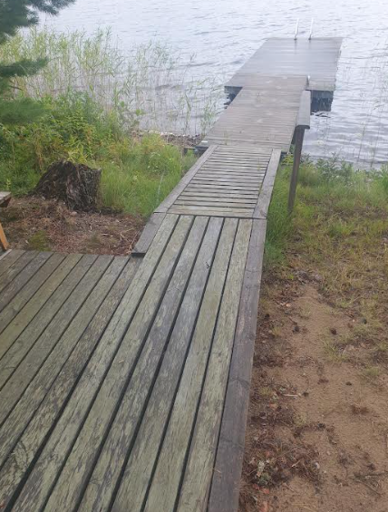
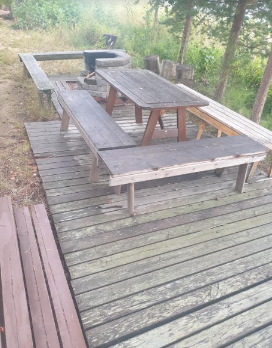

**TIEDOTE**

Hei kaikki rantasaunan käyttäjät!

Saunojen käyttö on ollut edellisiä vuosia vähäisempää.
Talkoilla tekemämme puut hupenevat kuitenkin kovaa vauhtia.

Uusi vesiautomaatti on toiminut hienosti ja helpottaa saunatoimia.
Nyt pesuhuoneissa on letkut jotka ylettyvät kiuassäiliöön asti.

Saunoísta huolehtimaan ja talkoita valmistelemaan on valittu Hannolat.
Ideoita toivotaan.

**Ennenkuin aloitat lämmittämään kiuasta poista tuhkat!**

Olkaamme kohteliaita seuraaville saunojille. Siivoamme aina saunan ja kannamme uudet klapit pukuhuoneiden puulaatikoihin.

Kaikille hyvää saunomiskesää !

Hallitus

**RANTASAUNA**

Paimensaaressa on ainutlaatuinen asumiskonsepti, jonka 12 vuoden kokemusten perusteella soisi yleistyvän järviemme rannoilla.

Savitaipaleen kunta on vuokrannut entisen leirikeskuksen saunan ja sitä ympäröivän maa-alueen Paimensaaren asukasyhdistyksen hallintaan, käyttöön ja hoitoon. **Yhdistyksen sääntöjen mukaisesti rantasaunan käyttöoikeus on vain jäsenillä (perhe) joka ovat maksanut liittymis-ja avainmaksun yheensä 20 €. Avamen voi sada "perintönä" edelliseltä asukkaalta. **Luonnollisesti jäsenellä voi olla vieraita mukana saunalla.

Paimensaaren asukasyhdistyksen jäsenten yksimielinen ajatus onkin, ettei kaikkien todellakaan tarvitse omistaa rantaviivaa ja omaa rantasaunaa. Ja usein tuntuukin, että on kylpömässä "omalla rantasaunalla" oman perheen kesken.

Saunaa kunnostetaan ja ylläpidetään talkoilla. isompia talkoita järjestetään ainakin kahdet vuodessa ja niiden lisäksi muutama henkilö hoitaa saunoja. Rantakaistaleelle on rakenneltu terassitasanne josa onm pöydät ja penkit sekä grillauspaikka.

Jäsenten on hyvä tiedostaa, ettei saunamaksu 2€/2h kata saunoista aiheutuvia kustannuksia, kun otetaan huomioon hoidossa tarvittavat kymmenien tuntien talkootyö ja polttopuut.

Saunamaksu peritään siltä ajalta, kun sauna on varattu yksityiskäyttöön. Pääasiassa klo 15-23 aikana 2 h jaksoina. Muina aikona saunat ovat yleiskäytössä ja maksuttomia. Jäsenen on kuitenkin mahdollista varata saunaa yksityiskäyttöön maksullisesti koko päivän aikana. Maksu 2€/2h. Asukasyhdistyksen jäsenten sidosryhmille saunamaksu on 10 €/sauna/ 2h.

MAKSA SAUNAMAKSUSI MIELUITEN VERKKOPANKISSA. VIITE; 1818 TAI esim. Saunamaksut 062023

Tulevaisuuden suunnitelmiakin on, mutta niistä sitten tällä palastalla ja tai uutisissa.

Hyviä saunailtoja!

Kuva sauna laiturilta 17.10.2015 klo 18.01. Kuva Paula Häkkinen.

Saunalla on nyt uusi krilli. 042023.

