Paimensaaren asukasyhdistys rakensi Savitaipaleen Paimensaaren haja-asutusalueelle valokaapeliverkon, joka liitettiin teleoperattorin valokaapeliverkkoon tammikuussa 2014. Kohderyhmänä ja hyödynsaajana ovat Paimensaaren, Hakamäen ja Kuhaniemen vakituiset asukkaat ja ns kakkosasunnon asukkaat sekä alueen yrittäjät. Lisäksi verkkoon on liittynyt Savitaipaleen kunnan ja seurakunnan kiinteistöjä sekä palveluyrittäjiä, että yhdistyksiä.

Paimensaaren verkko valmistui tammikuussa 2014 ja sen laajennus valmistui 31.10.2014. Liittymiä on nyt 92, joista käytössä on nyt 63, loput ovat eritasoisia varauksia. Valokaapelin kapasiteetissa on varauduttu 96 liittyjään päärunkokaapelin osalta. Kapasiteetti voidaan kaksinkertaistaa, kun siirrytään käyttämään yksi kuitu/ liittymä toteutustapaa. Kokonaiskustannukset olivat 210.792 €. Ely-keskuksen tuki oli 70 % tukikelpoisista kustannuksista. Tuki oli maksimissaan 119 000 €, joka käytettiin kokonaan. **ELY-keskus hyväksyi hankkeen valmiiksi 21.1.2015.**

Hankkeen tavoitteena oli säilyttää Paimensaari elinvoimaisena kylänä, jossa syntyy myös uutta yritystoimintaa. Hanke edistää haja-asutusalueen asukkaiden tasa-arvoa. Kunnan, valtion ja terveydenhuollon palvelut ovat jo siirtyneet verkoon. Valokaapeliverkkoliittymä auttaa ikäihmisiä asumaan kotonaan entistä kauemmin. Hankkeella on positiivisia ympäristövaikutuksia, koska videoneuvottelut ja puhelut tulevat yleistymään nyt ja lähitulevaisuudessa.
**Myös erikoistarkat eli Ultra HD (UHD/4K) palvelut ovat jo alkaneet ja 8K televisiot ovat jo kaupoissa. Niiden hyödytäminen vaatii huippunopeaa valokuituverkkoa. **

Nyt ihmisten ei tarvitse matkustaa palavereihin autolla, vaan töitä voi tehdä Paimensaaressa yhtä helposti kuin kaupungissa. Ainakin nykyiset yritykset ja työpaikat ovat säilyneet. Lisäksi uutta pienyritystoimintaa voisi syntyä erityisesti tietoteknisille aloille. Määrällisinä tavoitteina voidaan pitää kahden uuden perheen muuttamista alueelle.

Valokaapeli josta käytetään myös nimitystä valokuitu korvaa jo vanhaksi käyneen ja purkamisen alla olevan lankapuhelinlinjat. Se tekniikka on jo vanhentunut, hidas ja ukkosherkkä. Valokuidun kautta saadaan varmatoiminen ja huippunopea yhteys, jota jo nyt tarvitaan. Mobiilit puhelin ja dataverkot (3G, 4G) ovat tärkeitä lisäpalveluita silloin, kun liikutaan kodin ulkiopuolella. Niiden suuri ongelma on riittämätön nopeus haja-asustusaluilla ja maaseudulla. Ne aivät takaa tasa-arvoisuutta suurkaupunkeihin nähden. Valokuituverkko on myös perustana tulevalle nopealle 5G verkolle. Oikean 5G signaalin kantavuus on vain 50 m. Näyttää siltä, että 5G vaatii tukiasemat (mastot tai uudet katuvalaisintolpat) 50m välein. Joten käytännössä se on Wifi palvelu. Ongelma on myös se, ettei 5G signaali läpäise seiniä eikä ikkunoita ! On selvää, että 5G tukiasemia ei koskaan tule maaseudulle (taloudellinen mahdottomuus), mutta kun on valokuitu kotona, sen päähän voidaan asentaa 5G wifi laite. Tämä edellyttää, että 5G operaattirit suostuvat alopittamaan palvelut.

Valokaapeliverkko tarjoaa nopeat ja modernit 100 jopa 1000 megan tietoliikenneyhteydet ja toteuttaa uutta kaavailtua yleispalveluvelvoitetta. Projekti toimi myös hyvänä pilottina Etelä-Karjalan kylille, jotta laajakaista kaikille 2015 projektit lähtisivät etenemään Etelä-Karjalassa. Hankkeet liittyvät ministeriön 100 megan Suomi tavoitteeseen.

Liittymän hinnaksi muodostui omakotitaloille ja vastaaville 1290 €, rivitaloille 1250 € ja varauksille 1150 €.
Hinta saatiin edulliseksi tarkan ennakkosuunnittelun, onnistuneen urakkakilpailutuksen ja suuren talkootyömäärän avulla.

Projekti päättyi 30.11.2014.

Verkon käyttöönottojuhlat olivat 24.1.2014 Suvannossa.

Verkoon voi vielä tilata liittymän asukasyhdistykselta, mutta ELY-tukea ei ole enään käytettävissä. Ota tarvittaessa yhteys puheenjohtajaan. Palvelut tilataan Saimaan Kuitu Oy:ltä.

**Liittymän toteutuksen hinta:**

Liittymämaksu on entinen, niille jotka ovat jo maksaneet osan liittymämaksusta, mutta sen lisäksi laskutetaan mahdollisesti syntyvät todelliset toteutuskustannukset. Paimensaaren verkon alueella on vielä useita tontteja joihin kuitua ei ole vielä toteutettu. Kuituverkossa on reserviä ja liittymä on saatavissa kaikille. Kokonaan uusien liittymien osalta hinta on 1990 € ja siihen lisätään rakentamiskustannukset, jotka Paimensaaren verkon alueelle eivät ole kovin isot.

Paimensaaren verkko rakennettiin niin, että se voitiin liittää osaksi koko kunnan laajuista verkkoa, jonka rakentaminen valmistui pääosin vuonna 2019. Verkkoa rakentamaan ja ylläpitämään on 2015 perustettu Saimaan Kuitu Oy, jonka omistavat Savitaipaleen, Taipalsaaren, Lemin ja Luumäen kunnat. Yhtiöön voi mahdollisesti liittyä uusiakin kuntia. Entisen Suomenniemen kunnan (nyk. Mikkeliä) alueelle on syksyllä 2019 alkanut vaiheen 1. rakentaminen, joka jatkui 2020. Toinen vaihe alkoi keväällä 2021 ja jatkui 2022. Lappeenrannan alueella on myös tehty verkonrakentamista. Luumaäen kunnan valokuituverkon rakentaminen alkoi 2022 kesällä taajama-alueiltaKym ja jatkuu useamman vuoden.

Kuntien laajuista verkkoa tedään esimerkillistä yhteistyötä Lappeenrannan energiaverkko Oy.n, Kymenlaakson Sähkö:n, Luumäen Kaukolämpöyhtiön, Elisa Oyj.n, Telian kanssa ja kuntien kanssa sähköverkon, katuvalaistuksen ja kaukolämmön kanssa.

**Katso lisätietoja www.saimaankuitu.fi.**

**Paimensaaren asukasyhdistys hankkii palvelut Saimaan Kuidulta ja sen pääoperaattorilta BLC:ltä. **

**Saimaan Kuidun palveluhinnasto (hinnat sisältävät verkon vikahallinnan ja ylläpitopalvelut):**

**Saimaankuitu 100/100 33,30 €/kk**

**Saimaankuitu 300/300 40,30** €/kk
(mahdollistaa myö 8K TV lähjetysten katsomisen)

 Saimaankuitu Giga 1000/1000 70,70 €/kk

**Lisäksi on tarjolla muita palveluita.**

**Katso tarkemmin Saimaan Kuitu Oyn sivustolta.**

**Paimensaaren asukasyhdistys hoitaa itse osan verkkotietojen ylläpidosta, uusien liittymien suunnittelutöistä, verkkotietojärjestelmän tietojen päivityksistä, asennusvalvonnasta, kirjanpidosta ja verohallinnasta sekä toimistotöistä. Näistä aiheutuvien kulujen kattamiseksi yhdistys perii käytössä olevilta liittymiltä vuotuisen yhdistyksen hallituksen määräämän käyttömaksun, joka on 1.1.2023 alkaen 15 €/vuodessa (oli 25 €/v).**

Vanhat hinnat ja laskusmenettely lakkasivat 30.10.2016.

**Uusi laskutus alkoi 1.11.2016. Laskutuksen hoitaa BLC.**

 *

22.10.2013

Kaapelien asennusta auraamalla. Silloin kun vanhat kaapelit, putket ja kalliot eivät estä voidaan kaapelit asentaa nopeasti auraamalla. Paimensaaressa oli hyvin vähän tallaisia reittejä.

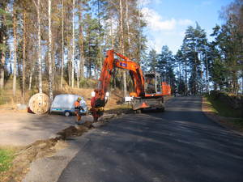

31.10.2013

Kuvassa on runkokaapelin muovinen 100 cm halkaisijainen ja 70 cm syvä jatkoskaivo, joka sijoitettiin maan alle. Jatkoskaivossa haaroitetaan runkokaapelit ja liitetään kiinteistökohtaiset kaapelit runkoverkkoon.

Runkokaapelin haaroitus ja tilaajakaapelien kytkentä (hitsataan) jatkoskotelossa ja kiinnitetään kytkentälevyille:

Asennus on tarkkuutta ja puhtausta vaativa työ. Se tehdään tyokopissa jota vedetään peräkärrynä. Kytkentöjen jälkeen jatkoskaivo sujetaan lieriömäisellä kannella.

Varsinaiset valokuidut ovat erittäin ohuita ja näkyvät kuvassa hiuksenhienoina päällystettyinä lankoina, joilla on tarkka värikoodijärjestelmä.

Paimensaaressa käytettiin pelkästään ruostumattomia jatkoskoteloita niiden pitkän takuuajan vuoksi.

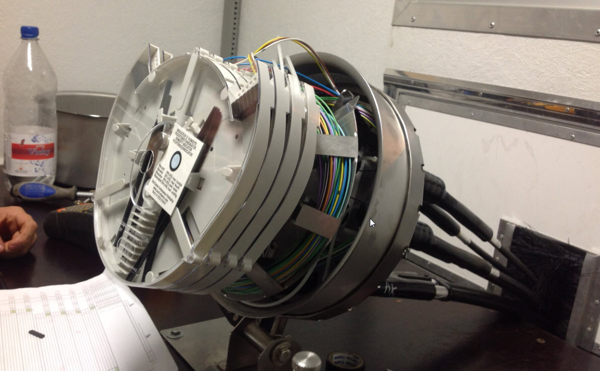

Runkokaapelin ja tilaajakaapelien ruostumaton jakokotelo kaivossa:
Kaapeleissa tulee olla reserviä n. 15m jatkoksen asennusta varten. Ylimäärä kiepitetään kaivoon.

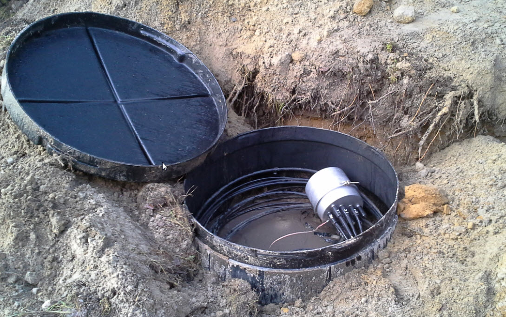

Kaivo peitettynä ja merkkitolpalla varustettuna:
Muutaman viikon kuluttua nurmikko peittää alueen kauniisti.

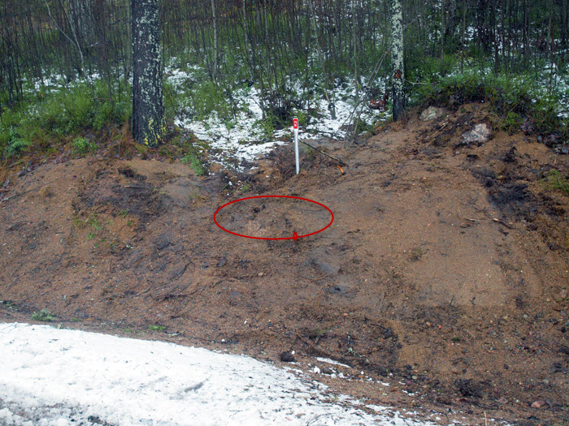

8.10.2013

Valokaapelin toteutusvaihe alkoi 8.10.2013 teiden alitusputkien asennuksella. Se tapahtui paineilmakäyttöisen "myyrän " avulla joka iskee reijän ja vetää putken perässään reikään. Näin vältyttiin tien katkaisulta ja häiriöltä liikenteelle. Toki hiekkatieosuuksilla katkaistiin teitä kaivamalla tai auraamallakin.

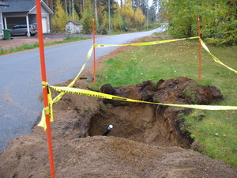

11.10.2013

Valokaapelin varsinainen asennus maahan alkoi keskiviikkona 16.10.2013 Suvannosta alkaen kohti Paimensaarta.

13.10.2013

Kaapeliasennusta Paimensaarentie 24A1-A4.ssä. Koko päivä siinä meni neljän asunnon kanssa kahteen mieheen Unton kanssa. Noin 70m kaapeliojaa ja putkea. Reikien teko oli iso urakka, kun piti purkaa verannan kaiteetkin.

Talkoo kannatti, sillä säästettiin iso tukku euroja.

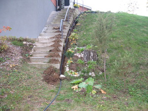

Kaapelioja päädystä portaiden vierestä ylös:

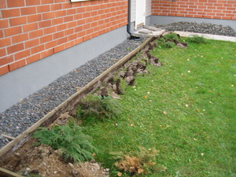

Kaapeliojaa pihanurmella laudan vieressä:

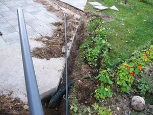

Pihalaattoja nostettiin ylös. Valokaapeli asennettiin 30 mm vasijohtoputken sisään, joka suojaa sitä. Sen vuoksi asennus voitiin tehdä matalaan 20-30 cm. Laattojen alla kaapeli on hyvässä suojassa.

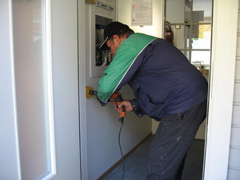

Jos huoneistoon ei pääse valmiita putkia pitkin joudutaan erilaisiin reijityksiin, jotka ovat joskus hankaliakin. Kuvassa apureikä porattiin eteisen seinään. Se peitetään kaapeliaukon kannella.

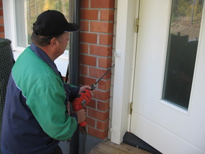

Reijän porausta oven karmin vierestä eteisen väliseinän sisään.

Kaapelin suojaputki tuotiin verannan lankkulattian läpi sisäänmenon alapuolelle.

Monissa taloissa valokaapeli tuotiin tiiliseinänkin läpi suoraan esim. olohuoneeseen. Aina löytyy reitti kaapelille.

Talopäätelaitteet sähkökotelossa.
Tässä mallissa ei ole Wifi ominaisuutta, joten sijainnilla ei ole suurta väliä. Päätelaitteesta laitetaan nettikaapelit (CAT 6 tyyppiä) talon verkkoon tai viedään suoraan esim. tietokoneelle tai TV:lle.

Uusissa päätelaitteissa on perustason Wifi valmiina, joten se kannattaa sijoittaa avoimeen paikkaan jotta signaali ei heikkene seinien vaikutuksesta. Parhaita paikkoja ovat olohuoneessa TV.n lähistöllä, koska TV liitetään suoraan päätelaitteeseen CAT 6 tai CAT 7 nettikaapelilla. Toki jos TVssä on Wifi-valmius voidaan liittyä langattomasti. Joskus joudutaan asentamaan lisäreitittimiä Wifin kantaman parantamiseksi.

Paras nopeus (palvelusopimuksen mukainen) saavutetaan, kun laitteet liitetään toisiinsa nettikaapelilla (CAT 6 tai CAT 7). 4K ja tuleva 8K TV (on jo käytössä Japanissa ja E Koreassa) tekniikka vaatii häiriöttömän kuvan saamiseksi CAT 6 tai CAT 7 kaapelit (ei Wifi).

Yle Areena on aloittanut 2022 satunnaiset 4K TV-lähetykset. Saa nähdä miloin alkaa 4K aikakausi. TV:t ovat olleet kaupassa ja kotona jo kohta 10 vuotta. Aikamoista ennakkomyyntiä!

Tulevaisuudessa 5G reititin liitetään nettikaapelilla kuitupäätteeseen. Ja saadaan 5G wifi huoneistoon. On hyvä tiedostaa, ettei **oikea 5G ole mobiili vaan wifi** jonka signaali ei läpäise seiniä eikä ikkunoita. Tarvitaan siis antenni ulkosäinään ja kaapeli sisälle ja sen päähän Wifi laite ja hintaa tulee n. 1000 €. Mobiilioperaattorit tekevät kyseenalaista markkinointia.

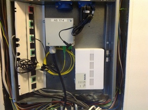
