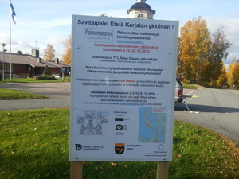

# EU-kylttien asennus

10.10.2013

 

Tänään kokosimme ja asensimme Arton kanssa EU infotaulut Peltoinlahdentien ja Nikkarintien risteykseen ja Paimensaarentien alkuun. Jos havaitsette, että taulu on kallistunut niin olkaa hyvä ja suoristakaa taulu.
