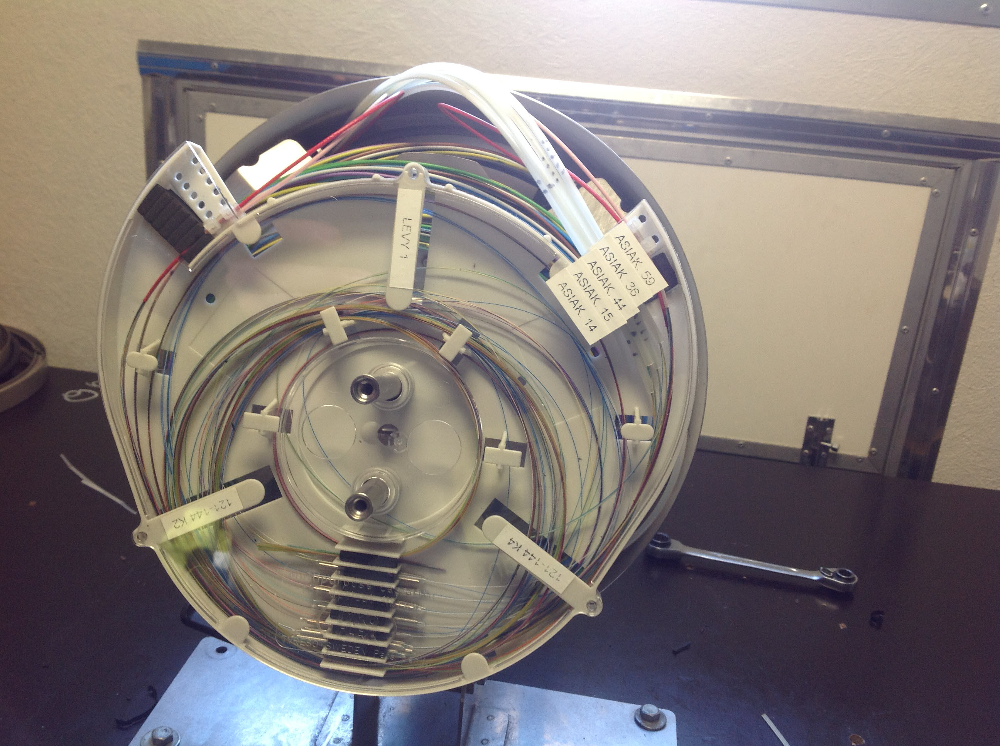

# Valokaapelin kytkentätyöt alkoivat 28.10.2013

31.10.2013

 

Valokaapelin runkokaapelin jatkosten kytkentätyöt alkoivat aikataulun mukaisesti.
Ruostumattomalla teräskuorella varustetut jatkokset sijaitsevat halkaisijaltaan 100 cm ja noin 70 cm syvissä muovisissa suojakaivoissa. Jatkoskohdissa runkokaapelia jatketaan ja liitetään runkoon asiakkaille kotiin tulevat valokaapelit. Vaativa liitostyö tehdään hitsaamalla puhtaassa työkopissa, jota kuljetetaan peräkärryssä.

Ensin tehdään nuo jatkoskohdat ja sitten talokohtaiset pääteasennukset, joihin päästään arviolta kahden viikon kuluttua. Aikataulusta tiedotetaan erikseen.
