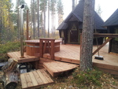

# UUDEN VUODEN VASTAANOTTAJAISET

30.12.2013

Hyvät Paimensaarelaiset!

Puheenjohtaja onkin jo laittanut asiasta emailia, mutta tässä muutamia tarkennuksia.

Juhlat alkavat Leirikujan ja Paimensaarentie risteyksen parkkipaikalla noin klo 2300.

Tosiaankin pannaan raketit yhteen koriin ja saadaan komea ilotulitus. Asukasyhdistys tarjoaa alkoholitonta glögiä. Muistakaamme, että nuorisomme on mukana ja alkoholia käytämme sivistyneen kohtuullisesti. Juhlapaikalla palavat jätkänkynttilät ja makkaraa on mahdollista paistaa.

Artolla lämpiää puolenyö korvilla kotasauna ( mahtuu 11 henkilöä kerrallaan ) ja paljukin on kuumana.

Grillikodassa voi jatkaa taikojen tekemistä ja paistaa makkaraa, ym, nyyttikestiperiaatteella.

Ne, jotka haluavat nauttia kotasaunan pehmeistä löylyistä ja rentouttavasta paljusta, ottakaa mukaan pyyhe, uikkarit, saunajalkineet, esim. Crocsit tai vastaavat ja vaikkapa kylpytakki, jos tuntuu tarpeelliselta. Saunominen yhteissaunaperiaatteella.

Isolla terasilla on mahdollisuus tanssahdella tervapatojen loisteessa.

Kaikki lämpimästi tervetuloa!
