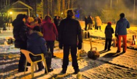
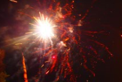
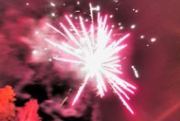

# Paimensaaren Uudenvuoden vastaanottajaiset olivat 31.12.2017 klo 23:00

01.01.2018

**Perinteiset Paimensaarelaisten, valokuituverkon asiakkaiden ja heidän ystävien yhteinen Uudenvuoden vastaanottajaiset olivat Paimensaaressa Leirikujan ja Paimensaarentien risteysalueen parkkikentillä alkaen 31.12.2017 klo 23.**

**Vuosi sitten kokoonnuttiin isolla joukolla vastaavasti ja silloin oli mahtava ilotulitus jolla aloitettiin Suomi 100 vuotta juhlavuosi Paimensaaressa. Nyt meitä oli yli 50 henkeä päättämässä Suomi 100 teemavuotta. Ilotulitus oli vähintäänkin yhtä hieno kuin vuosi sitten.**

Tällainen iloinen yhteisöllinen ja mahtava tapahtuma saadaan aikaan, kun mahdollisimman moni tulee paikalle. Monilla on mukana myös omat ilotulitteensa ja niistä koostuu mahtava näytelmä vuoden vaihtuessa.

**Yhdistys on aina mukana tapahtumassa avustamassa, mutta ei järjestäjänä. Yhdistys tarjosi lögiä ja pipareita. Periteisesti nautitaan myös omia eväitä.**

**Kiitos kaikille ja hyvää alkanutta vuotta 2018**

***Kari***

 
