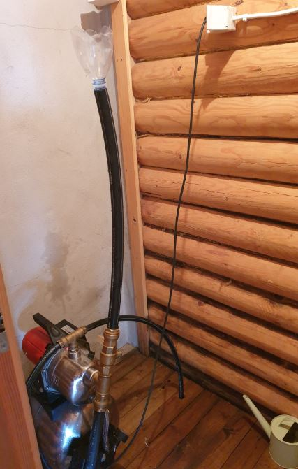
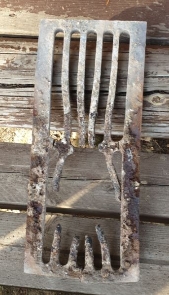
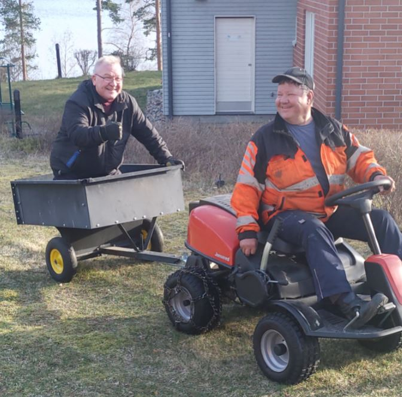

# Rantasauna odottaa saunojia

23.04.2020

**Pidimme pikkutalkoot 23.4.2020 saunalla**

- laitoimme vesipumpun käyttöön. Asensimme imuputken paikoilleen järveen ja pumppuun siemenveden täyttösysteemin. Nyt ei tartte kahta tuntia liruttaa vettä käyttöönotossa.

- Korjasimme ovet niin, että ne menevät helposti kiinni
- Saunan 2 kiukaan arina on sulanut pilalle. Käyttäjien pitää poistaa liika tuhka pesästä.
Jos on liikaa tuhkaa se sulattaa arinan, joka ei ole halpa.

- Välillä oli vauhdikasta menoakin

Nyt on tieteellisesti osoitettu, että sopiva saunominen vieläpä joka toinen päivä on
erittäin terveellistä.

Maittavia ja terveellisiä saunahetkiä kaikille koronakesästä huolimatta.

Saunalla on aikalailla siistiä. Laajaan kevättalkooseen ei ole tarvetta, mutta polttopuita kannattaa kuitenkin tehdä, Niitä voi pienellä ryhmälläkaydä tekemässä. Siivotakin saa vapaasti.

*Kari ja Upi*

**
