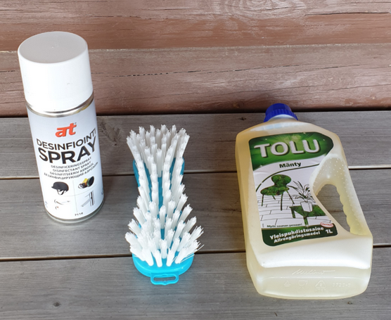

# Paimensaaren as yhdistyksen rantasaunojien huomioon

07.05.2020

Hei kaikki !

Molemmilla saunoilla on nyt omat hygieniatuotteet, joiden avulla voi puhdistaa käytön jälkeen (ja/tai ennen sitä) saunan lauteen, pesuvadin / ämpärin / kauhan ja kahvoja sekä tarvittaessa penkin.

- Se mitä käytät, puhdista!

- Käytä isoa laudeliinaa. Laita pesuun kotona.

- Saunasta poistuttaessa desinfioi spray suihkauksella kahvat, avaimenperä sekä kätesi.

- Pese kätesi ja jalkasi kotona.

- Oireisena tai jos epäilet oletko saanut tartunnan älä mene yhteissaunaan. Silloinhan pitää olla karanteenissa.

Ilmat tässä paranee, joten voidaan ulkoilla ja nauttia keväästä ja kesästä. Tästä voi kaikki nauttia, myös 70+

Ulkoilmassa ei ole virusta, siitepölyä kylläkin. Virus tarttuu taudin kantajasta ei luonnosta.

Perheenjäsenet ovat kotonakin vierekkäin. Kyllä he silloin voivat ulkonakin ja muuallakin olla vierekkäin.
Muuten kahden metrin turvaväli on hyvä asia ja silloin ei tarvitse hengityssuojaakaan.

Terveisin

**Kari**

