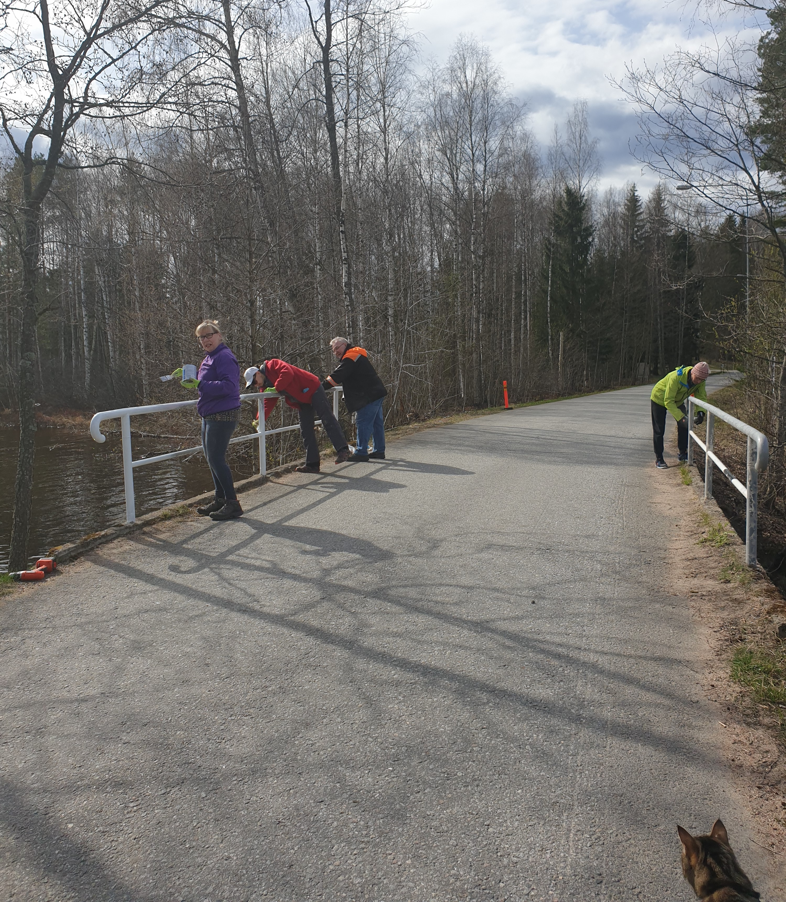
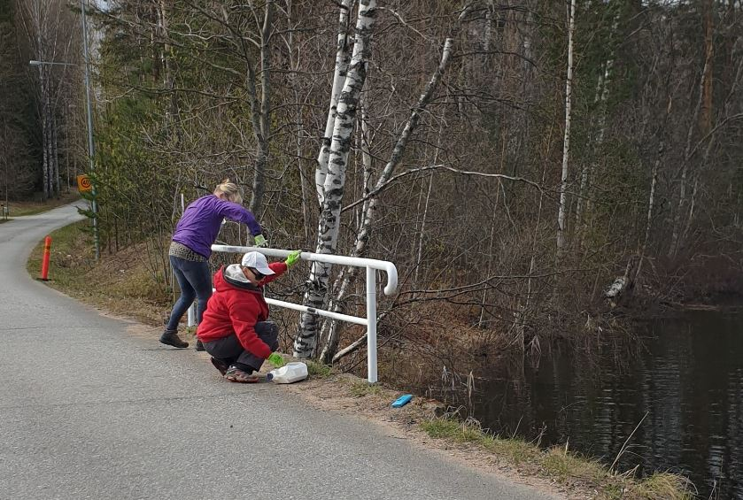
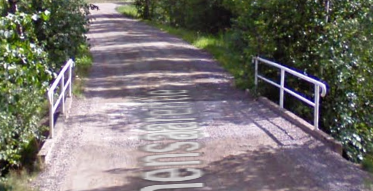

# Paimensaaren sillan kaiteet maalattiin

07.05.2020

Paimensaaren sillan kaitdeputket olivat kuluneet ja ruostuneet rumiksi.

Pieni talkooryhmä maalasi ne perjantaina 8.5.2020 iltapäivällä.

Hionnan, ruosteenesto- ja pintamaalauksen jälkeen niistä tuli kauniita Äitienpäiväksi.
Kunta kustansi materiaalit.

Tietysti hiomalaikka putosi järveen ja oli hoidettava homma loppuu käsin (laikan onginta onnistui)

Kaiteet maalattiin nyt kuten ennenkin valkoisiksi.

Tiedoksi ! Kunnan puistoryhmä siivoaa Paimensaaren tienvarren risut pois.

"Pidä Paimensaari siistinä" ajatuksella.

Merja, Larisa, Kari ja Esko

Kuvassa reipasta menoa. Oikeassa alakulmassa yleisö seuraa tapahtumaa tarkkana.

Kiitos Tarja kuvauksesta.

Silta joskus ennen.

