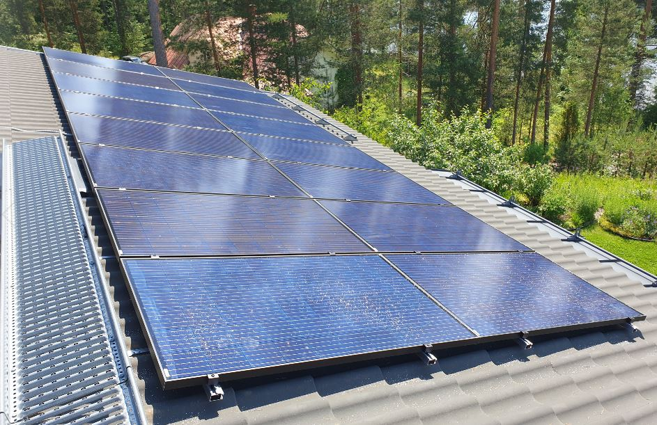
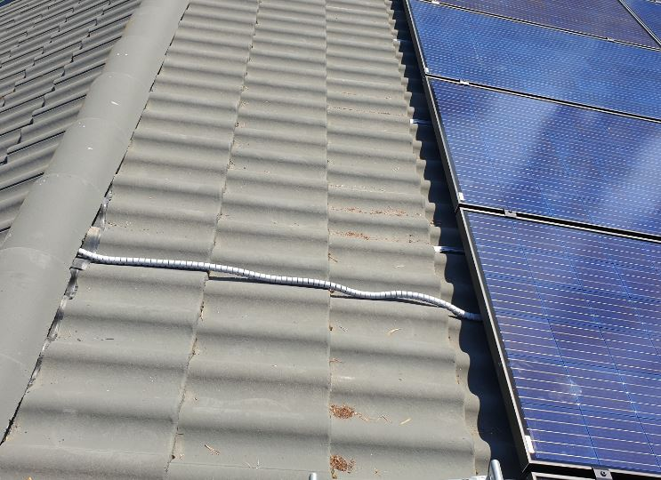
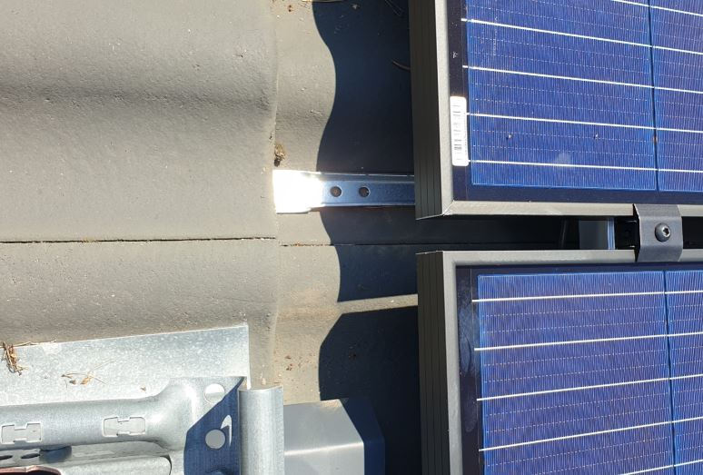
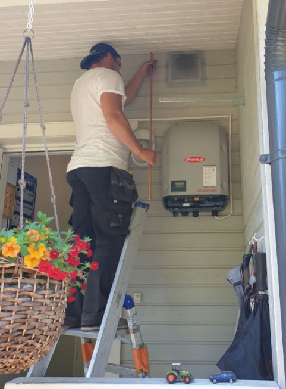
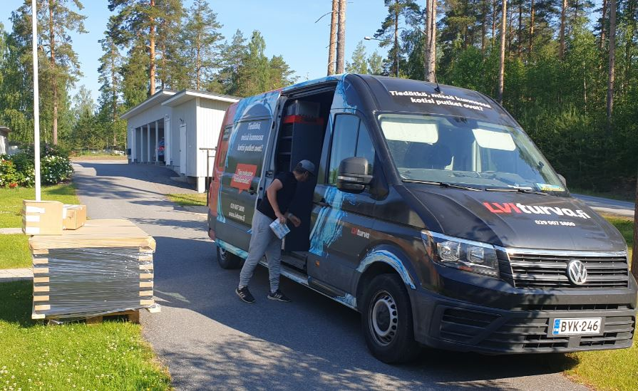

# Aurinkovoimala käyttöön Paimensaarentiellä

24.06.2020

Tänään asennettiin ja otettiin käyttöön aurinkovoimala Paimensaarentie 24 A 4:ssä.

Rivitalon järvenpuoleiselle lappeella asennettiin 16 monikidepanelia joiden teoreettinen
maksimiteho 4650 W . Pitäisi riittää suurimman osan vuotta omavaraisuuteen ja nopeaan
takaisinmaksuun.

KSS sähkösopimus sisälsi virtuaaliakun verkossa jonne myyn ylijäämän 11c/kwh ja otan sieltä tarvittaessa.

Kokonaishintataso 10 000 €, josta saa ison kotitalousvähennyksen.

Tulen julkaisemaan tuotantotietoa yms infoa näillä sivuilla ja sasry.fi verkkosivuilla.

Paikanpäälläkin voi käydä tutustumassa.

Toimitaja oli Taloturva. Asennus tapahtui käyttökuntoon 3,5 tunnissa. Kyllä kaverit tekikin töitä
urakkatahtiin. Ullakolla oli varmaan yli 40 C kun asentaja sieltä veti johtoja.

Tiilikattoon ei tule yhtään reikää.

Terveisin

Kari Kotirinta

