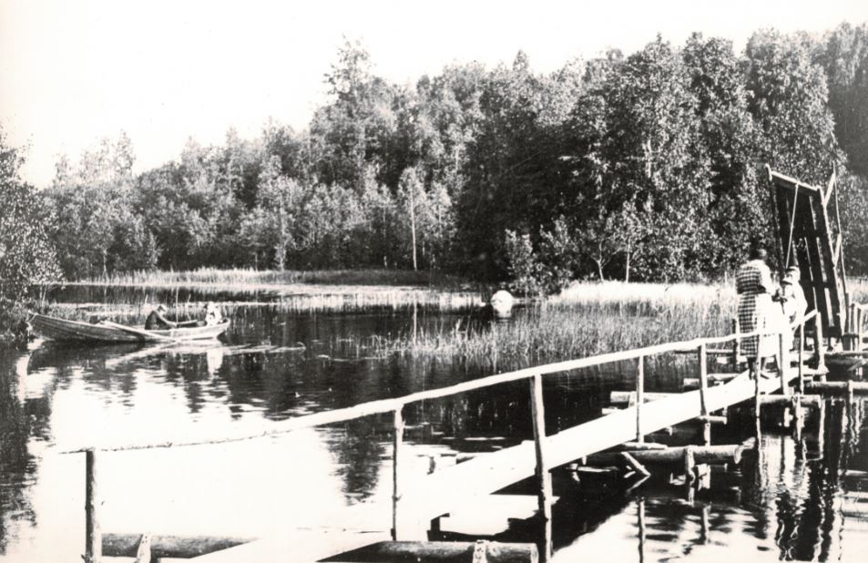
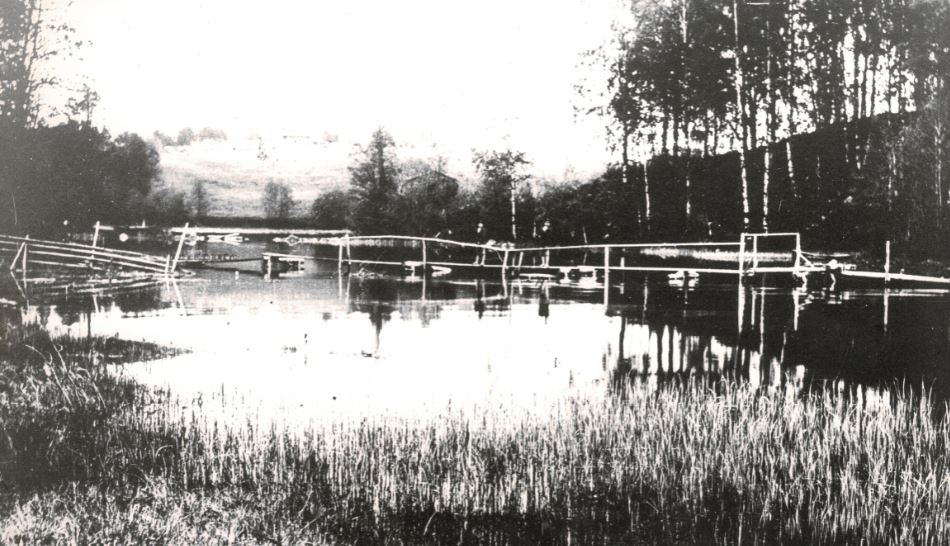
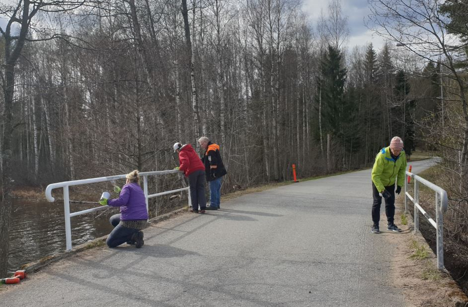

# Paimensaaren avattava silta 1900 luvun alussa

18.10.2020

Paimensaareen oli kuljettu veneillä, kunnes 1900 vuosisadan alussa
oli rakennettu kevyt pitkospuumainen silta saareen. Mielenkiintoinen
on sillan avattaavuus, että veneet pääsivät salmen poikki.

Kuvat antoi julkaistavaksi ne pelastaneet taltioineet Anneli ja Tuomo Kirjavainen.
Heillä on paljon vastaavia historiallisia kuvia Savitaipaleesta. He ovat asuneet
täällä elämänsä. Kaikki muistavat heidät kylälle niin tärkeinä kelloseppinä.

Anneli ja Tumo, kiitos teille.

Alinna kuva sillasta nyt kevään maalaustalkoissa.

