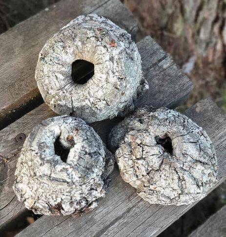

# Veden lämpötila 2020 Rantasaunan laiturin päässä

24.10.2020

Laiturin päässä on nyt uusi mittari.

Tässä lukemia, katsottu samalla kun käyty "uimassa":

07.11.2020 klo 15, 7,0 C
24.10.2020 klo 18, 8,0 C Talkoot
03.10.2020 klo 18, 13,0 C
28.09.2020 klo 18, 13,0 C
23.09.2020 klo 18, 13,0 C
19.09.2020 klo 18, 13,0 C
05.09.2020 klo 18, 17,5 C
08.08.2020 klo 20, 22,5 C
24.07.2020 klo 20 19,5 C
10.07.2020 klo 19, 19.5 C
06.07.2020 klo 19, 20,0 C
28.06.2020 klo 08, 25,0 C
27.06.2020 klo 08, 25,0 C
20.06.2020 klo 22, 22,5 C
19.06.2020 klo 13, 22,0 C
15.06.2020 klo 18, 20,0 C
12.06.2020 klo 15, 16,0 C
06.06.2020 klo 19, 13,0 C
29.05.2020 klo 19, 12,5 C
21.05.2020 klo 18, 11,5 C
15.05.2020 klo 19, 9,5 C
09.05.2020 klo 20, 9,5 C
08.05.2020 klo 18, 10,5 C

Ilta 23.9.2020 klo 18.45.

