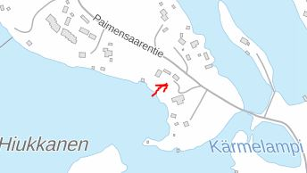
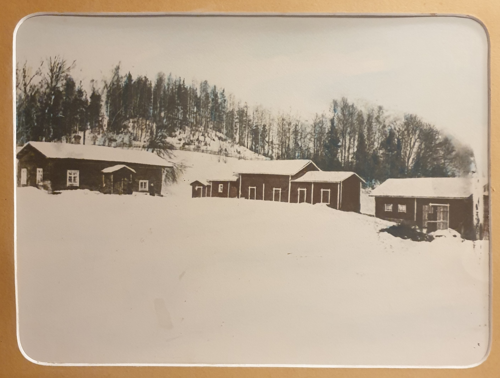

# Paimensaaren ainoa talo 1800 luvulla

09.11.2020

Paimensaaren sukutalo oli ainut talo Paimensaaressa 1800 luvulla. Ainonpolku 1.
Saareen kuljettiin veneellä ja jäätä pitkin. Kunnes tehtiin pitkospuusilta 1900 luvun alussa.
Paimensaaren talolla oli oma venevaja ja laituri josta soudettiin Haimilan kohdalla olleeseen venelaituriin.
Siitä laiturista oli veneliikenne saariin ja Suomenniemen puolelle.

Tie Paimensaareen kulki kirkonkylässä Nikkarintieltä salmen rantaan.

Paimensaaressa oli kärrytie länsirantaa pitkin pelloille, joita oli mäen päällä ennen, kuin 1960 luvulla tuli

jo 1980 lopulla poistunut leirialue. Nyt siinä on rivitaloja ja ok-taloja. Peltoja oli myös molemmin puolin saaren rantoja nykyisen sillan jälkeen.

Valokuva on Eero Paimensaaren omistamasta isosta valokuvataulusta kotitalostaan. Kiitos Eero!

Asuinrakennus vasemmalla oli myöhemmin kaksikerroksinen. Osa piharakennuksista on vieläkin olemassa. Eero rakennutti uuden nykyisen talon 2000 luvun alussa. Vanhan talon palokunta poltti harjoittelunaan.

