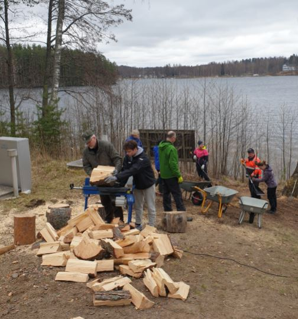
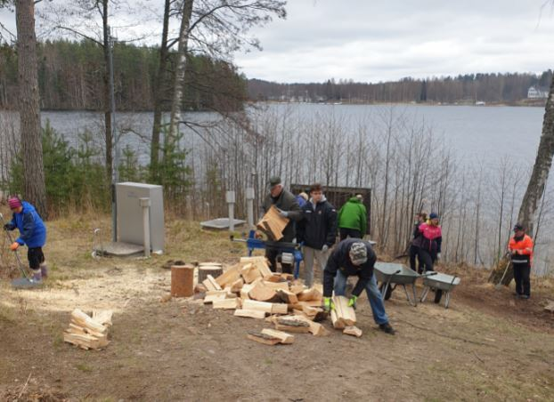
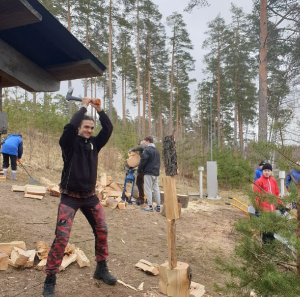
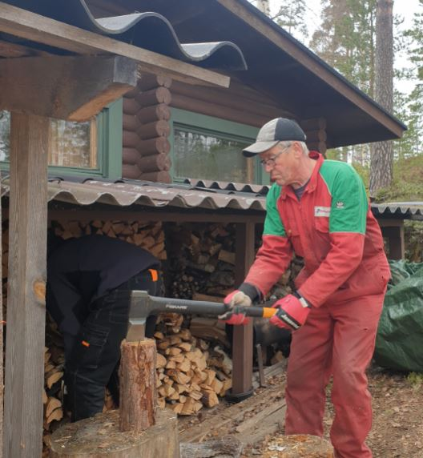
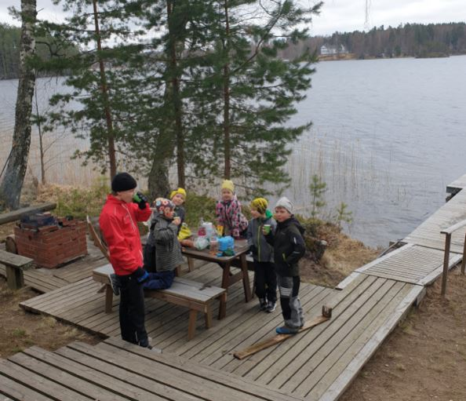
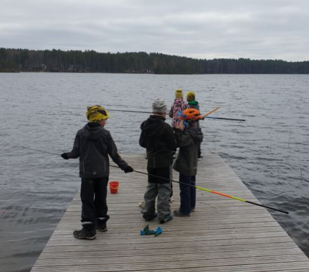

# Kevättalkoot olivat rantasaunalla la 8.5.2021

08.05.2021

Pidettiin pienimuotoiset kevättalkoot rantasaunalla la 8.5.2021.
Talkoot piti alkaa päivällä, mutta innokkaimmat oli töissä jo aamulla. Mahtavaa!

Sopivan kokoisella porukalla saatiin tehtyä paljon töitä.
- yksi puunrunko pätkittiin, pilkottiin ja pinottiin
- veisautomaatti laitettiin päälle, putki järveen
- ranta-alueen risujen ja karikkeiden mahtava poistotyö. Arja totesi ettei näin siistiä
 ole ollut koskaan. Risut ja karikkeet vietiin jäteasemalle.
- erilaisia huoltotöitä tehtiin

Perinteiset makkarat krillattiin tietysti!

Kiitos kaikille reippailijoille

*Hallitus*

Kyllä sauna ja pulahdukset Kuolimoon (6 C) teki terää talkoon jälkeen.

