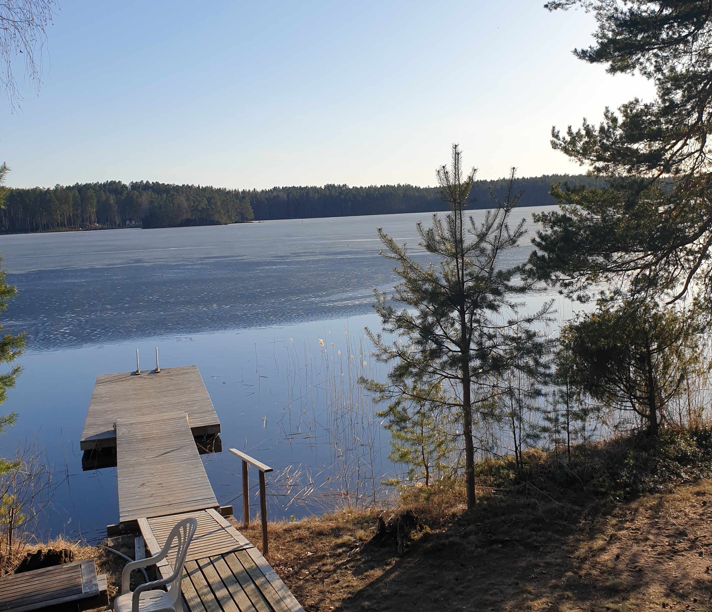

# Veden lämpötila 2021 Rantasaunan laiturin päässä

07.06.2021

**Tässä seurataan Kuolimon veden lämpöitilaa koko saunakauden 2021.**

**Talviturkki jäi minulta Kuolimoon 17.4.2021 klo 18. Kuvat alla.**
**Aurinko ehti lämmittämään mittaria pari astetta. Vertailuksi: 09.05.2020 klo 20, 9,5 C**

23.10.2021 klo 17, 6 C, talkoot
01.10.2021 klo 17, 10 C
19.09.2021 klo 18, 11 C
10.09.2021 klo 08, 13 C
22.08.2021 klo 18, 18 C
09.08.2021 klo 07, 19 C
02.08.2021 klo 07, 20 C
01.08.2021 klo 07, 21 C
24.07.2021 klo 18, 21 C
19.07.2021 klo 07, 24 C
17.07.2021 klo 07, 26 C
16.07.2021 klo 07, 27 C
15.07.2021 klo 18, 29 C
10.07.2021 klo 18, 27 C
09.07.2021 klo 18, 25 C
05.07.2021 klo 19, 25 C
01.07.2021 klo 17, 24,5 C
28.06.2021 klo 08, 23 C
27.06.2021 klo 08, 23 C
25.06.2021 klo 18, 22,5 C
21.06.2021 klo 08, 22 C
19.06.2021 klo 20, 21,5 C
16.06.2021 klo 18, 17,5 C
10.06,2021 klo 19, 23 C?
06.06.2021 klo 08, 18 C
05.06.2021 klo 19, 19 C
03.06.2021 klo 19, 13,5 C
02.06.2021 klo 19, 16 C
22.05.2021 klo 20, 11 C
19.05.2021 klo 12, 15 C
12.05.2021 klo 20, 10 C
08.05.2021 klo 16, 6 C, talkoot
30.04.2021 klo 19, 5,5 C
17.04.2021 klo 18, 5 C

