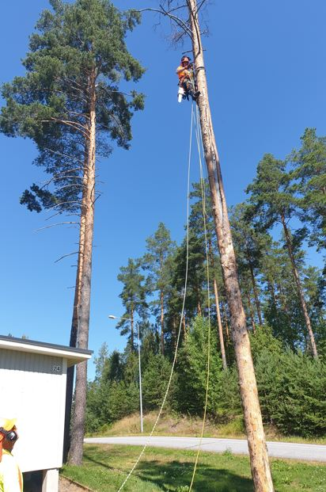
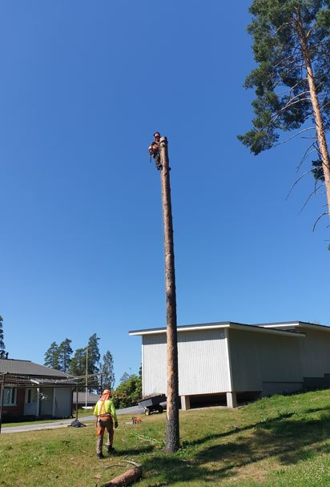
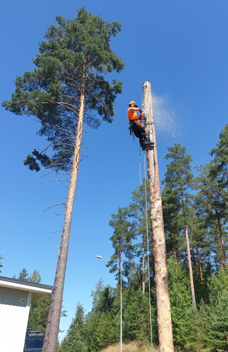
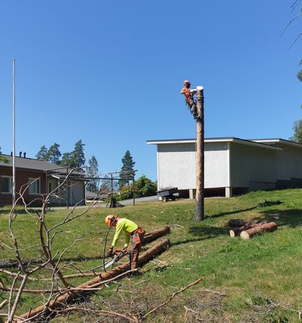

# Polttopuita saunalle

10.07.2021

Perjantaina 9.7.2021 kaadettiin Paimensaarentiellä kaksi puuta, joista saatiin
pöllejä saunalle. Voidaan talkoissa tehdä klapeja.

Paimensaarentie 24 kohdalla kuivunut mänty oli puoliväliin laho ja katkeamisvaarassa.

Puusta jätettiin korkea kanto. Siitä tehdään mielenkiintoinen nähtävyys. Se valmistuu
viimeistään keväällä 2022.

Kari

