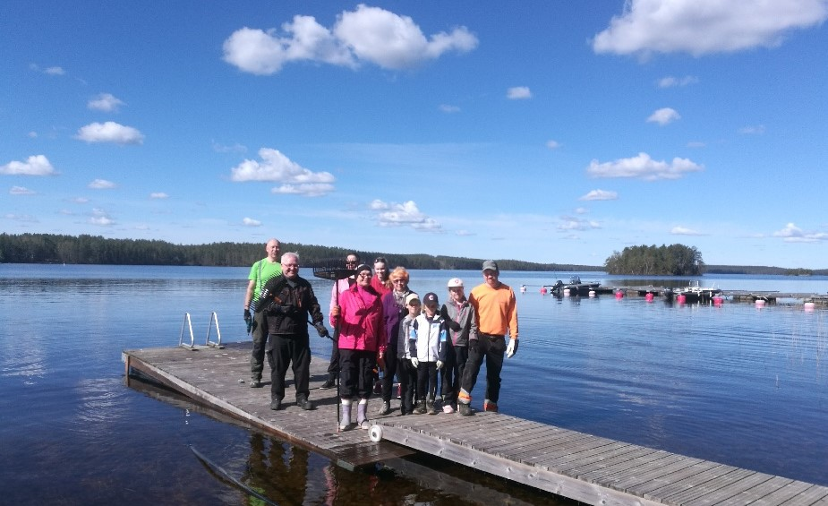
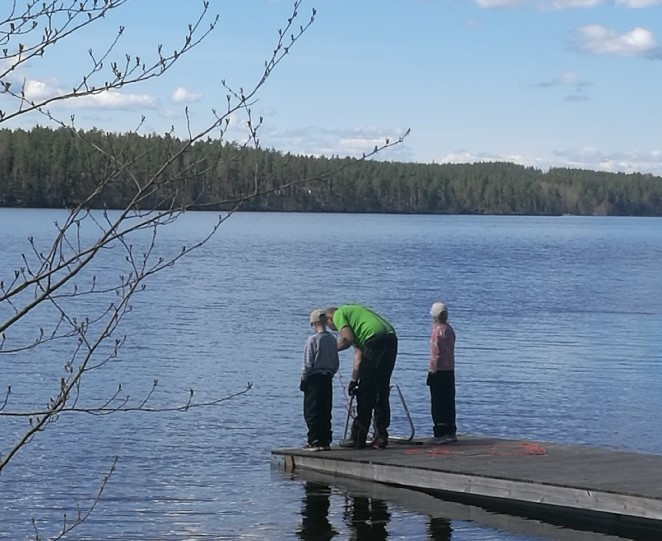

# Talkoot olivat rantasaunalla la 14.5.2022 klo 10

11.05.2022

Kevättalkoot pidettiin rantasaunalla la 14.5.2022 alkaen klo 10.

Työlistalla oli mukavia töitä.
- polttopuiden pilkkomista ja pinoamista
- veisautomaattin päälle laiotto ja putki järveen
- ranta-alueen ja rinteen risujen keruu
- karikkeiden haravointi kasoihin

Pienehkö mutta tehokas perukka hoiti hommat, joita oli aika lailla.
Risujen keruuta rinteeseen jäi vielä sekä pöllien halkomisia.

Siellä ne odottaa ahertajia!

Perinteiset makkarat krillattiin ja kahveeta sekä virvokkeita nautittiin!

Lopuksi saunottiin ja käytiin tietysti Kuolimossa pulahtamassa. VESI 8C klo 16.

Kiitos järjestelyistä Katri ja Jaakko.

*Hallitus*

*Kuviissa näkyy pääosa talkooporukasta ja todella kunis maisemamme.*

**

**
