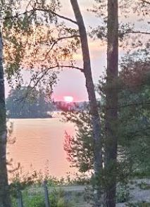

# Kuolimon veden lämpötila rantasaunalla, kesä 2022

13.08.2022

Kuolimon veden lämpötila Paimensaaren rantasaunan laiturin päässä kesä 2022.

10.09.2022 klo 18 14 C
19.08.2022 klo 19 24 C
13.08.2022 klo 19 24 C
06.08.2022 klo 19 21 C
01.07.2022 klo 18 24 C
24.06.2022 klo 20 22 C Juhannusaatto
21.05.2022 klo 20 8 C
14.05.2022 klo 16 8 C

Juhannuksena oli todella hyvä sää, lämmintä lähes 30C. Ja se jatkui heinäkuulle.

