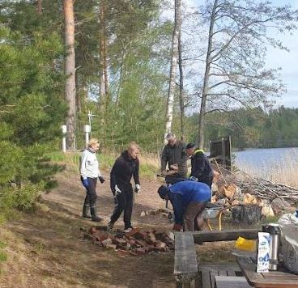
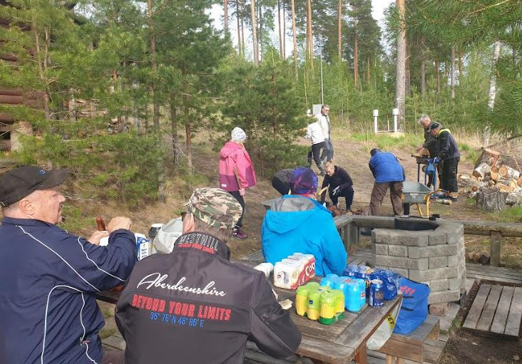
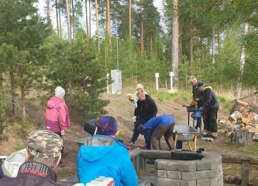
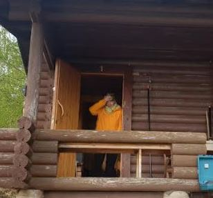

# KEVÄTTALKOOT OLI RANTASAUNALLA

17.05.2023

Kevättalkoot Paimensaaren rantasaunalla olivat ke 17.5.2023 illalla.

Sattui juuri sopiva sää, ei liian kumma, tuulista kuitenkin oli se esti maalaukset.

Meitä oli mahtava porukka joka laittoi hihat heilimaan joten tulosta syntyi.

Perinteiset hommat:

-polttopuiden pilkkominen ja pinoaminen
-haravointia, vanhan krillin tiilet pois jne.
-siivousta jne.

Maalaushommat siirtyivät.

Välipalaa ja kahveeta nautittiin.

Kiitos järjestelyistä Katrille ja Jaakolle.

Lopuksi saunottiin kunnolla. Kyllä on hyvä kiuas nyt myös saunassa 2.
Tietysti järvessä piti käydä. Kuolimon vesi 8C.

*KIITOS KAIKILLE!
*

*Katri saunan ovella: Taas se kahvi valui penkille, ei ollut pannua alla!*

**
